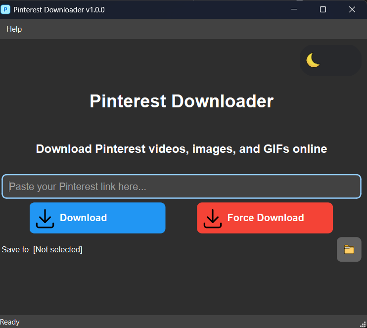

# 📌 pinterest-media-scraper

  

pinterest-media-scraper is a Streamlit-based desktop/web app to download images and videos from Pinterest pins, boards, and profiles—quickly and reliably.

---

## ✨ What’s New 

- 🎉 **Initial release** with core download and UI functionality  
- 🔄 Improved URL normalization & validation  
- 🕸️ Enhanced fallback scraping for robust media extraction  
- ⚙️ Better error handling and user feedback  
- 🖱️ Cleaner UI with quick-select buttons (“First 5”, “First 10”, “All Files”)  

---

## 🛠️ All Features

- 📥 Download images & videos from Pinterest pins, boards, profiles  
- 🔄 Custom BeautifulSoup scraping for media extraction
- 📦 Save media as original files or bundled ZIP archive  
- ⚡ Quality & advanced settings: timeout, retries, concurrency  
- 👁️‍🗨️ Media preview cards with progress tracking  
- 🎛️ Professional Streamlit UI with sidebar settings & live metrics  

---

## 🗂️ Folder Structure

```

Pinterest-Media-Downloader/
├── LICENSE                    # MIT license
├── README.md                  # This file
├── requirements.txt           # Python dependencies
├── src/                       # Source directory
|   └── main.py                # Streamlit app entry point
├── favicon.ico            # App icon
└── screenshots/           # UI previews
    └── screenshot.png


````

---

## 📋 Requirements

- **Python 3.8+**  
- **pip** package manager  
- **Streamlit**  
- **requests**  
- **beautifulsoup4**  
- **Pillow**  
- **lxml**

Install via:

```bash
pip install -r requirements.txt
````

> Or manually:
>
> ```bash
> pip install streamlit requests beautifulsoup4 pillow lxml
> ```

---

## ⚙️ Installation

1. **Clone** the repo

   ```bash
   git clone https://github.com/ukr-projects/pinterest-media-scraper.git
   cd pinterest-media-scraper/src
   ```
2. **Install** dependencies

   ```bash
   pip install -r ../requirements.txt
   ```

---

## ▶️ Usage

1. **Run** the app:

   ```bash
   streamlit run src/main.py
   ```
2. **Enter** a Pinterest URL (pin, board, or profile)
3. **Click** “🔍 Analyze URL” to fetch media links
4. **Choose** how many files to download or use quick-select
5. **Click** “🚀 Start Download” to save images/videos (ZIP option available)
6. **Monitor** progress and download individual files or archive

---

## 📸 Screenshot



---

## 🤝 How to Contribute

1. **Fork** the repository
2. **Create** a branch:

   ```bash
   git checkout -b feature/YourFeature
   ```
3. **Implement** your changes & **commit**
4. **Push** and **open** a Pull Request

---

## 🙏 Acknowledgments

* **Streamlit** for rapid UI development
* **BeautifulSoup** for HTML parsing
* **Requests** for HTTP sessions
* **Pillow** for media handling

## 🌟 Star History

If you find this project useful, please consider giving it a star on GitHub! Your support helps us continue improving and maintaining this tool.

## 📞 Support

- **GitHub Issues**: [Report bugs or request features](https://github.com/ukr-projects/pinterest-media-scraper/issues)
- **Discussions**: [Community discussions and Q&A](https://github.com/ukr-projects/pinterest-media-scraper/discussions)
- **Email**: ukrpurojekuto@gmail.com

---

<div align="center">

**Made with ❤️ by the Ujjwal Nova**

[⭐ Star this repo](https://github.com/ukr-projects/pinterest-media-scraper) | [🐛 Report Bug](https://github.com/ukr-projects/pinterest-media-scraper/issues) | [💡 Request Feature](https://github.com/ukr-projects/pinterest-media-scraper/issues)

</div>
